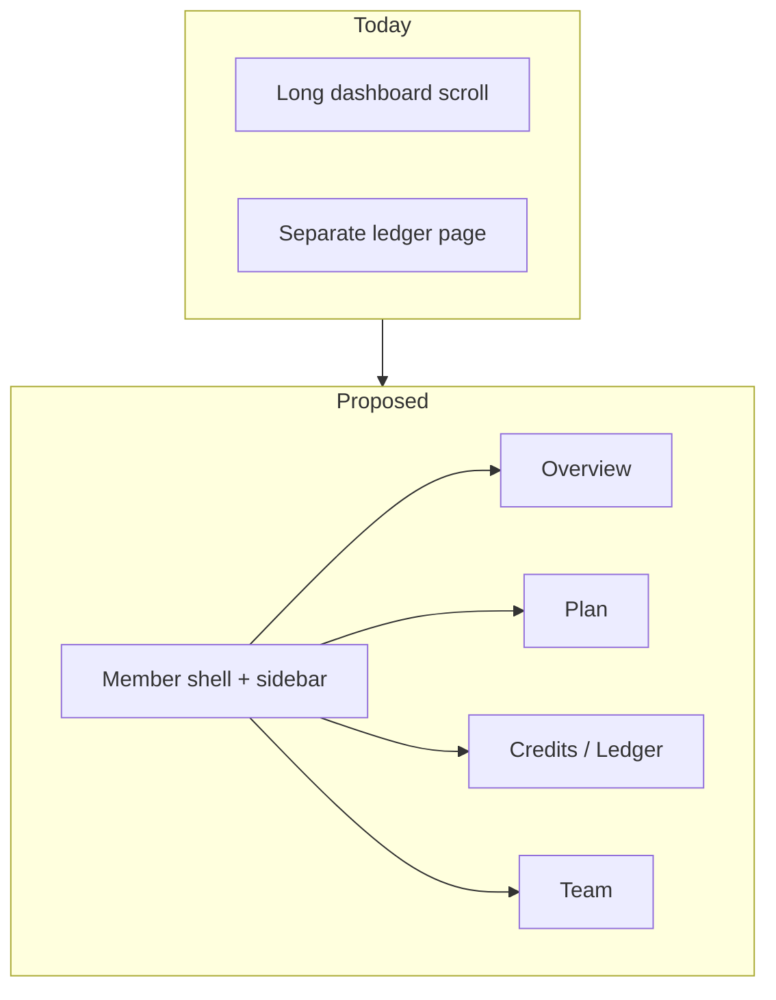

# Plan: Member dashboard & credit ledger redesign

> Goal: Shorter, clearer member area with sidebar + tabs, and credit numbers that don’t read as “800 of 500.”
> Scope: Eijent landing app (`/dashboard`, `/dashboard/ledger`). Core APIs stay as-is unless a small display-field helper is needed.

---

## Problems today

1. **Long, repetitive page** – Account, subscription, summary strip, modules, limits, credits, and usage all stack on one scroll. Credits appear in the header, summary strip, and a credits section again.
2. **No navigation chrome** – Ledger is a separate full page with weak relationship to the dashboard; no shared shell/sidebar.
3. **Confusing credit math** – UI shows `balance / allocation` (e.g. `800 / 500`). That looks like “800 out of 500 capacity,” but:
   - **Allocation** = plan grant per cycle (500)
   - **Balance** = what’s left to spend (can be **above** allocation after pack purchases or rollover)
   - Used this cycle is a third number (`allocation`-ish vs deductions), not `balance/allocation`
4. **Limits still say `— / 8`** until usage sync; reads like a bug.
5. **Ledger** is dense (many filters + wide table + KPIs) without a clear hierarchy.



---

## Design principles

- **One job per view** – Overview = glance; Plan = entitlements; Credits = wallet + ledger; Team = people.
- **Say what the number means** – Never imply balance is capped by allocation unless it really is.
- **Progress only when it maps** – Entity limits (used/max) use bars; wallet uses available + breakdown, not fake progress.
- **Shared shell** – Sidebar (desktop) / bottom or top tabs (mobile) so ledger isn’t a disconnected page.
- **Stay on-brand** – Match existing Eijent landing tokens; avoid generic purple dashboard kits.

---

## Credit number model (fix first / with UI)

| Show | Meaning | Example |
| ---- | ------- | ------- |
| **Available** | Spendable balance (hero number) | 800 |
| **Plan grant** | Credits from plan this cycle | 500 / month |
| **From packs / rollover** | Extra above plan (derived or labeled) | +300 |
| **Used this cycle** | Deductions in period | 120 |
| **Low alert** | Banner only when `isLowOnCredits` | below threshold |

**Stop showing:** `800 / 500` as a single fraction.

**Optional hint when balance > allocation:**  
`Available 800 · includes pack top-ups (plan grant 500)`.

Used this cycle: prefer API `totalDeducted` (or ledger summary), not `allocation - balance` (wrong with packs/rollover).

---

## Proposed IA

### Shell

```text
[ Eijent ]  Member name · status
---------------------------------
 Overview | Plan | Credits | Team     (tabs)
   or
 Sidebar: Overview / Plan / Credits / Team / Sign out
```

- Routes: `/dashboard` (overview), `/dashboard/plan`, `/dashboard/credits` (ledger-first), `/dashboard/team`
- Or single `/dashboard` with client tabs + `/dashboard/credits` deep-link for ledger
- Keep “Go to app” as secondary CTA when ready

### Tab: Overview (short)

Above the fold only:

1. Greeting + status + low-credit banner if needed  
2. **Available credits** (large) + link “View history”  
3. Plan name + Active + 2–3 key limits (seats, workspaces)  
4. Compact team count  

No full module grid, no duplicate credit cards, no long limit list.

### Tab: Plan

- Pricing / service plan summary (billing cycle, next invoice, credit reset)  
- Modules as compact chips or accordion (not giant cards)  
- Limits with clear `used / max` or `Not synced yet` instead of `— / 8`

### Tab: Credits

Top: wallet summary (Available, Plan grant, Used this cycle, Packs if any)  
Below: **ledger** (current Credit Ledger filters + table), not a second “credits usage” wall.

### Tab: Team

- Owner + sub-accounts list only  
- Optional: spend by user (small chart/list), linked from Credits if needed  

---

## Ledger UX polish

- Sticky filter bar; collapse advanced filters behind “More filters”  
- KPI row: Available · Credited · Deducted · Pack purchases (labels already OK; align wording with Overview)  
- Table: Date · Type · Feature · Who · Workspace · Amount · Balance after  
- Default sort newest; empty state explains “no movements yet”  
- Mobile: card rows instead of horizontal scroll when possible  

---

## Visual / layout notes

- Max content width ~1120px; sidebar ~220px  
- Overview height target: fit common laptop viewport without scrolling past CTA  
- Use existing CSS variables; light section dividers, not stacked heavy cards everywhere  
- Progress bars only for entity limits with known `used`  

---

## Implementation phases

### Phase 1 – Number clarity (quick win)

- [x] Replace all `balance / allocation` displays with **Available** + separate **Plan grant**  
- [x] Header credits, summary strip, credits section, ledger KPI hint: same vocabulary  
- [x] Limits: `Not synced` copy when `used` is null  
- [x] Smoke-check with pack-purchased wallet (balance > allocation)

### Phase 2 – Shell + tabs

- [x] `MemberShell` layout (sidebar desktop, tabs mobile)  
- [x] Split Dashboard into Overview / Plan / Team sections or routes  
- [x] Mount ledger under Credits tab/route  
- [x] Shared nav active states + deep links  

### Phase 3 – Densify content

- [x] Modules → chips / accordion  
- [x] Collapse duplicate subscription + summary strip into Plan tab  
- [x] Ledger filter collapse + mobile cards  
- [x] Optional: “What’s in my balance?” expandable breakdown  

### Phase 4 – Polish

- [x] Empty / loading skeletons  
- [x] Accessibility (tab keyboard, focus, aria)  
- [x] Update `eijent/docs/member-dashboard.md`  

---

## Out of scope (for this redesign)

- Changing Core wallet math or reset rules  
- Buying packs in the member UI (unless already planned)  
- Agent app shell (this is landing member area only)  

---

## Success criteria

1. Overview fits one screen for a typical Active member with synced limits.  
2. No UI shows balance as “X / allocation” in a way that implies a hard cap.  
3. Ledger reachable in one click from Overview without losing member nav.  
4. Member can answer in &lt;5s: how many credits can I spend, when do they reset, what’s my plan.

---

## Suggested first ticket

**Title:** Fix member credit display (stop showing balance as X / allocation)

**Description:** Replace `balance / allocation` across dashboard + ledger with Available vs Plan grant labels; handle balance &gt; allocation after packs/rollover; show “Not synced” for unused entity counts.
